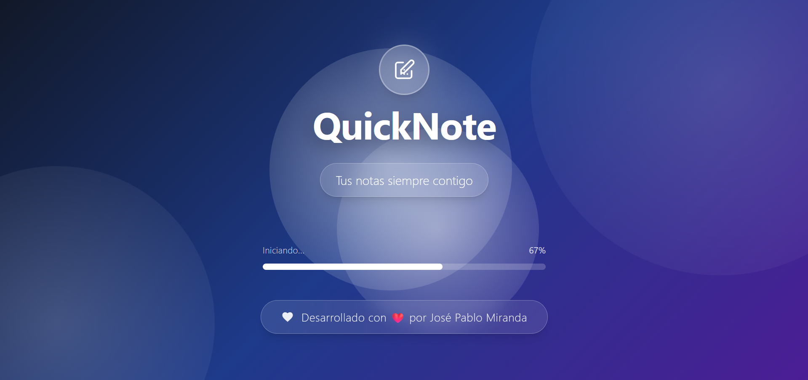
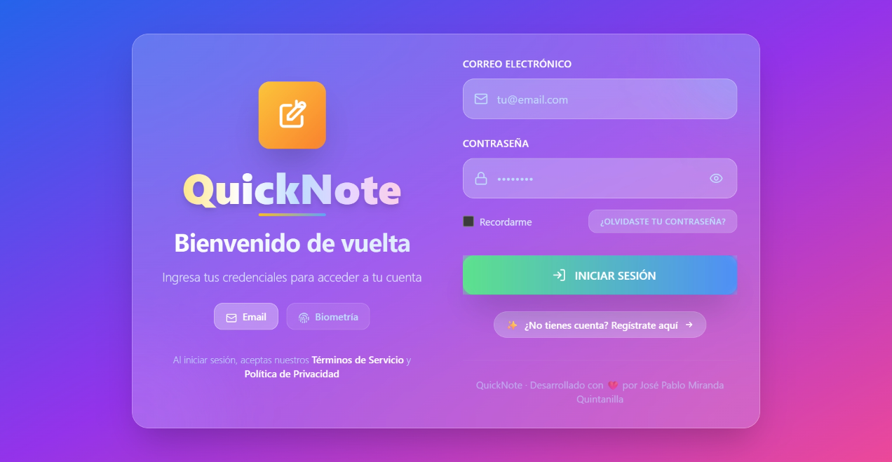
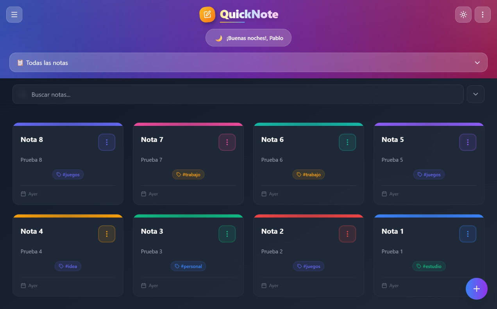
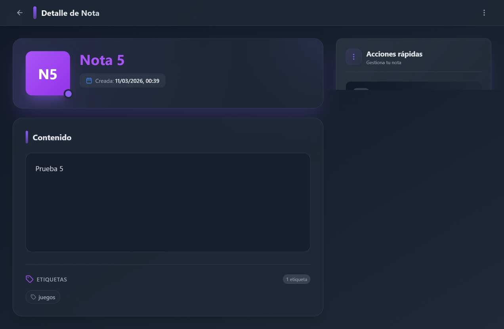
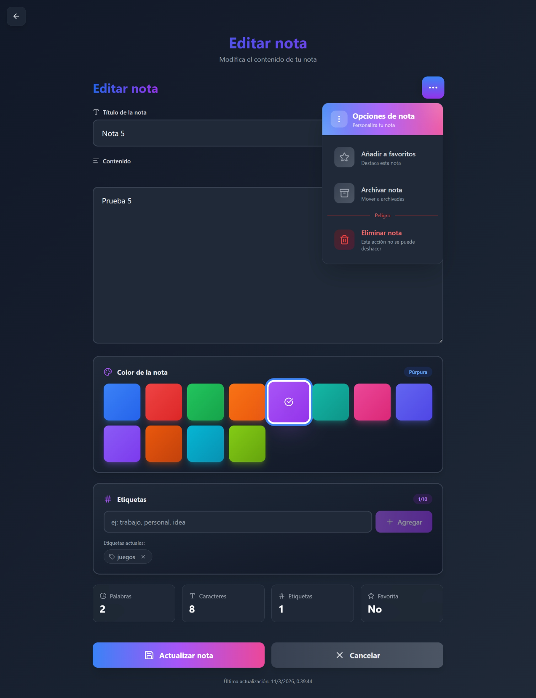
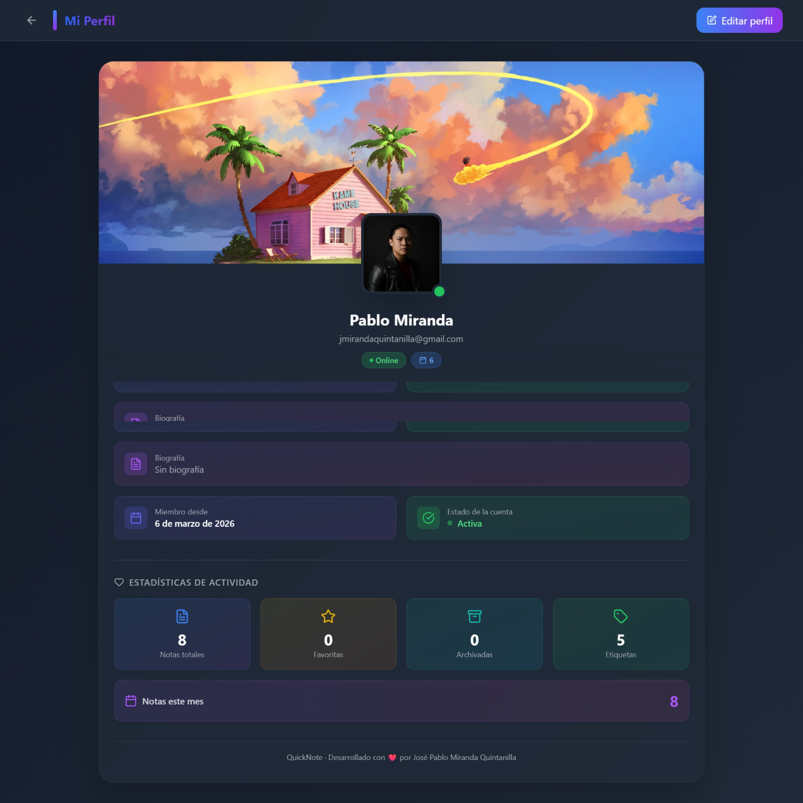
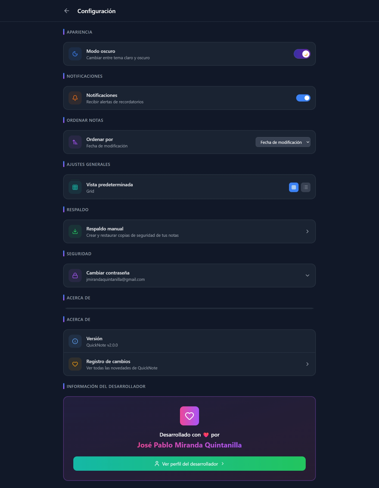
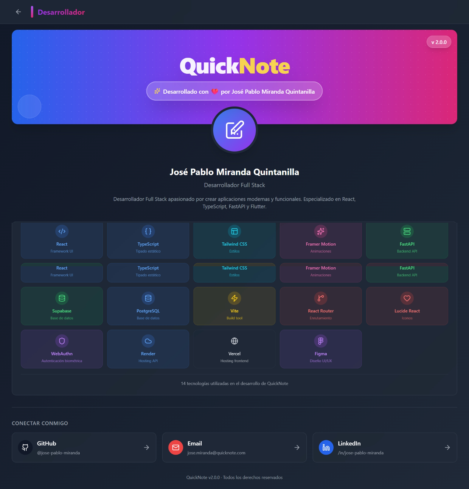
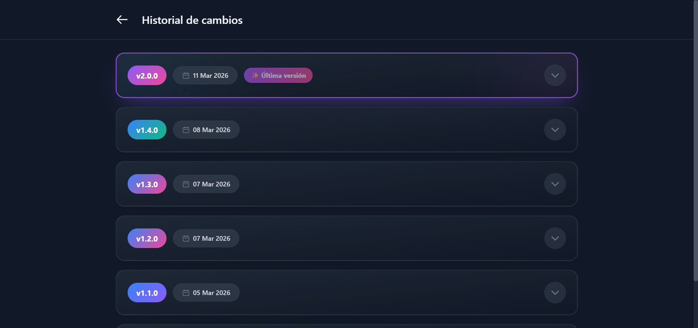

# 📝 QuickNote Web

<div align="center">
  
  
  
  ### Una aplicación moderna de notas con React, TypeScript, Supabase y autenticación biométrica
  
  [](https://reactjs.org/)
  [](https://www.typescriptlang.org/)
  [](https://tailwindcss.com/)
  [](https://supabase.com/)
  [](https://vitejs.dev/)
  [](https://webauthn.io/)
  [](LICENSE)
  
  ### 🚀 **Versión 2.0.0 - Rediseño Completo y Autenticación Biométrica**
</div>

## 📋 Tabla de Contenidos

- [✨ Características](#-características)
- [🔐 Autenticación Biométrica (Nuevo)](#-autenticación-biométrica-nuevo)
- [🛡️ Seguridad y Aislamiento de Datos (Nuevo)](#️-seguridad-y-aislamiento-de-datos-nuevo)
- [🎨 Rediseño UI/UX (Nuevo)](#-rediseño-uiux-nuevo)
- [🖼️ Capturas de Pantalla](#️-capturas-de-pantalla)
- [🚀 Tecnologías](#-tecnologías)
- [📁 Estructura del Proyecto](#-estructura-del-proyecto)
- [⚙️ Instalación](#️-instalación)
- [🔧 Configuración](#-configuración)
- [🗄️ Base de Datos (Supabase)](#️-base-de-datos-supabase)
- [🌐 Servidor Backend (Passkeys)](#-servidor-backend-passkeys)
- [📖 Uso](#-uso)
- [🧩 Componentes Principales](#-componentes-principales)
- [🧪 Scripts Disponibles](#-scripts-disponibles)
- [📄 Changelog](#-changelog)
- [🤝 Contribuir](#-contribuir)
- [📄 Licencia](#-licencia)
- [👤 Desarrollador](#-desarrollador)

## ✨ Características

### 📝 Gestión de Notas
- ✅ **CRUD completo**: Crear, leer, actualizar y eliminar notas
- ✅ **Vistas múltiples**: Grid y lista con toggle animado
- ✅ **Selección múltiple**: Eliminar notas en lote
- ✅ **Ordenamiento avanzado**: 6 opciones (fecha, título, favoritas)
- ✅ **Colores personalizados**: 8 colores predefinidos por nota

### 🏷️ Sistema de Etiquetas
- ✅ **Asignación múltiple**: Varias etiquetas por nota
- ✅ **Filtrado dinámico**: Por etiquetas en el header
- ✅ **Gestión visual**: Colores únicos por etiqueta
- ✅ **Vista de nube**: Visualización de etiquetas más usadas

### ⭐ Organización
- ✅ **Favoritos**: Marca notas como favoritas
- ✅ **Archivado**: Mueve notas a archivadas
- ✅ **Papelera**: Restaura notas eliminadas (soft delete)
- ✅ **Eliminación permanente**: Vaciar papelera

### 📅 Calendario
- ✅ **Vista mensual**: Notas organizadas por fecha
- ✅ **Navegación intuitiva**: Cambio entre meses
- ✅ **Indicadores visuales**: Días con notas

## 🔐 Autenticación Biométrica (Nuevo en v2.0.0)

### 🖐️ Passkeys (WebAuthn)
- ✅ **Inicio de sesión biométrico**: Huella dactilar, Face ID, Windows Hello
- ✅ **Registro de dispositivos**: Múltiples dispositivos por usuario
- ✅ **Tokens JWT HS256**: Sesiones seguras con expiración de 7 días
- ✅ **Verificación criptográfica**: Con `@simplewebauthn/server`

### 📧 Autenticación Tradicional
- ✅ **Email/Password**: Login y registro con Supabase Auth
- ✅ **Tokens ES256**: Generados por Supabase
- ✅ **Sincronización perfecta**: Mismo usuario ve sus notas sin importar el método

### 🔄 Sistema Dual Unificado
- ✅ **Middleware inteligente**: Verifica tokens HS256 (passkey) y ES256 (Supabase)
- ✅ **Extracción consistente**: `userId` siempre disponible en `req.user`
- ✅ **Cliente Supabase unificado**: Usa el token del usuario para respetar RLS

## 🛡️ Seguridad y Aislamiento de Datos (Nuevo en v2.0.0)

### 🔒 Row Level Security (RLS)
- ✅ **Aislamiento total**: Cada usuario solo ve sus propias notas
- ✅ **Políticas completas**: SELECT, INSERT, UPDATE, DELETE con `auth.uid() = user_id`
- ✅ **Verificación en backend**: El token del usuario se usa en cada petición

### 🗑️ Soft Delete
- ✅ **Columna `deleted_at`**: Mover notas a papelera sin eliminarlas
- ✅ **Restauración**: Recuperar notas eliminadas
- ✅ **Filtrado inteligente**: Notas activas vs eliminadas

### 🔐 Manejo Seguro de Tokens
- ✅ **Expiración**: 7 días para todos los tokens
- ✅ **Almacenamiento**: LocalStorage con limpieza automática al cerrar sesión
- ✅ **Verificación**: Cada petición valida el token

## 🎨 Rediseño UI/UX (Nuevo en v2.0.0)

### ✨ Interfaz Moderna
- ✅ **Glassmorphism mejorado**: Efectos de vidrio con backdrop blur
- ✅ **Animaciones suaves**: Transiciones optimizadas en todos los componentes
- ✅ **Componentes reutilizables**: Diseño consistente en toda la app

### 📱 Diseño Responsive
- ✅ **Adaptación perfecta**: Todos los tamaños de pantalla
- ✅ **Menús colapsables**: Optimizado para móviles
- ✅ **Gestos táctiles**: Navegación intuitiva en dispositivos táctiles

### 🌙 Modo Oscuro/Claro
- ✅ **Transiciones suaves**: Cambio de tema sin parpadeos
- ✅ **Persistencia**: Preferencia guardada en localStorage
- ✅ **Colores optimizados**: Paleta adaptada para cada tema

## 🖼️ Capturas de Pantalla

<div align="center">
  <table>
    <tr>
      <td colspan="2" align="center">
        
        <br />
        <em>✨ Splash Screen de inicio con animaciones</em>
      </td>
    </tr>
    <tr>
      <td></td>
      <td></td>
    </tr>
    <tr>
      <td align="center"><em>🔐 Página de login con opción de Passkey</em></td>
      <td align="center"><em>📝 Página principal de notas</em></td>
    </tr>
    <tr>
      <td></td>
      <td></td>
    </tr>
    <tr>
      <td align="center"><em>🔍 Detalle de nota con acciones verticales</em></td>
      <td align="center"><em>📋 Formulario con selector de color</em></td>
    </tr>
    <tr>
      <td></td>
      <td></td>
    </tr>
    <tr>
      <td align="center"><em>👤 Perfil de usuario con avatar y banner</em></td>
      <td align="center"><em>⚙️ Configuración y gestión de passkeys</em></td>
    </tr>
    <tr>
      <td></td>
      <td></td>
    </tr>
    <tr>
      <td align="center"><em>👤 Perfil del desarrollador</em></td>
      <td align="center"><em>📊 Historial de cambios</em></td>
    </tr>
  </table>
  
  <p>
    
    
  </p>
</div>

## 🚀 Tecnologías

### Frontend
| Tecnología | Versión | Uso |
|------------|---------|-----|
| **React** | 18.3.1 | Biblioteca principal |
| **TypeScript** | 5.0 | Tipado estático |
| **React Router** | 7.1 | Enrutamiento |
| **Tailwind CSS** | 3.4 | Estilos y diseño |
| **Framer Motion** | 12.35 | Animaciones |
| **Vite** | 6.0 | Build tool |

### Backend y Autenticación
| Tecnología | Versión | Uso |
|------------|---------|-----|
| **Express** | 5.2.1 | Servidor Node.js para passkeys |
| **@simplewebauthn/server** | 13.2.3 | Verificación WebAuthn |
| **jsonwebtoken** | 9.0.3 | Generación de tokens JWT |
| **Supabase** | 2.99.0 | Base de datos PostgreSQL y Auth |
| **PostgreSQL** | 15 | Base de datos relacional |
| **Row Level Security** | - | Seguridad por usuario |

### Utilidades
| Tecnología | Uso |
|------------|-----|
| **date-fns** | Manejo de fechas |
| **uuid** | Generación de IDs |
| **react-hot-toast** | Notificaciones |
| **clsx** | Condicionales de clases |
| **concurrently** | Ejecutar servidor y frontend juntos |
| **nodemon** | Auto-reload del servidor |

## 📁 Estructura del Proyecto


quicknote-web/
├── src/
│ ├── components/ # Componentes reutilizables
│ │ ├── layout/ # Componentes de layout (Header, Menús)
│ │ ├── notes/ # Componentes de notas (Card, Form, Detail)
│ │ ├── tags/ # Componentes de etiquetas (Chip, Cloud)
│ │ ├── auth/ # Componentes de autenticación (PasskeyLogin)
│ │ └── ui/ # Componentes UI genéricos (Toast, Spinner)
│ ├── pages/ # Páginas de la aplicación
│ │ ├── NotesPage.tsx # Página principal de notas
│ │ ├── NoteDetailPage.tsx # Detalle de nota
│ │ ├── NoteFormPage.tsx # Formulario de nota
│ │ ├── LoginPage.tsx # Página de login
│ │ ├── RegisterPage.tsx # Página de registro
│ │ ├── DeveloperPage.tsx # Perfil del desarrollador
│ │ ├── SettingsPage.tsx # Configuración
│ │ ├── ChangelogPage.tsx # Historial de cambios
│ │ └── ... # Otras páginas
│ ├── contexts/ # Contextos de React
│ │ ├── AuthProvider.tsx # Contexto de autenticación
│ │ ├── NoteContext.tsx # Estado global de notas
│ │ └── ThemeContext.tsx # Tema oscuro/claro
│ ├── hooks/ # Custom hooks
│ │ ├── useAuth.ts # Lógica de autenticación
│ │ ├── useNotes.ts # Lógica de notas
│ │ └── useTheme.ts # Lógica de tema
│ ├── services/ # Servicios externos
│ │ ├── api.ts # Peticiones HTTP con logs detallados
│ │ └── supabase.ts # Cliente Supabase
│ ├── api/ # API del servidor de passkeys
│ │ └── passkey/ # Endpoints de WebAuthn
│ │ ├── auth/ # Autenticación
│ │ └── register/ # Registro
│ ├── models/ # Modelos de datos
│ │ ├── Note.ts # Modelo de nota
│ │ └── DeveloperProfile.ts # Perfil desarrollador
│ ├── utils/ # Utilidades
│ │ ├── noteColors.ts # Sistema de colores
│ │ ├── noteUtils.ts # Utilidades de notas
│ │ └── sortUtils.ts # Utilidades de ordenamiento
│ └── styles/ # Estilos globales
│ └── globals.css
├── server.ts # Servidor Express para passkeys
├── public/ # Archivos públicos
├── .env.example # Variables de entorno ejemplo
├── .env.development # Variables para desarrollo
├── .env.server # Variables para el servidor
├── tsconfig.json # Configuración de TypeScript
└── README.md


## ⚙️ Instalación

### Prerrequisitos
- Node.js 18+
- npm o yarn
- Git
- Cuenta en Supabase (gratuita)

### Pasos de instalación

```bash
# 1. Clonar el repositorio
git clone https://github.com/JosePablo1996/QuickNote-Web-APP.git
cd QuickNote-Web-APP

# 2. Instalar dependencias
npm install

# 3. Configurar variables de entorno para el frontend
cp .env.example .env.development
# Edita .env.development con tus credenciales de Supabase

# 4. Configurar variables de entorno para el servidor
cp .env.example .env.server
# Edita .env.server con tus credenciales

# 5. Iniciar en desarrollo (frontend + servidor)
npm run dev:full

# 6. Abrir en el navegador
# http://localhost:5173


## ⚙️ Instalación

### Prerrequisitos
- Node.js 18+
- npm o yarn
- Git
- Cuenta en Supabase (gratuita)

### Pasos de instalación

```bash
# 1. Clonar el repositorio
git clone https://github.com/JosePablo1996/QuickNote-Web-APP.git
cd QuickNote-Web-APP

# 2. Instalar dependencias
npm install

# 3. Configurar variables de entorno para el frontend
cp .env.example .env.development
# Edita .env.development con tus credenciales de Supabase

# 4. Configurar variables de entorno para el servidor
cp .env.example .env.server
# Edita .env.server con tus credenciales

# 5. Iniciar en desarrollo (frontend + servidor)
npm run dev:full

# 6. Abrir en el navegador
# http://localhost:5173

🔧 Configuración
Variables de Entorno - Frontend (.env.development)

VITE_API_URL=http://localhost:3001/api/v1
VITE_SUPABASE_URL=tu_url_de_supabase
VITE_SUPABASE_ANON_KEY=tu_llave_anonima_de_supabase
VITE_SUPABASE_SERVICE_ROLE_KEY=tu_llave_service_role
VITE_DOMAIN=localhost
VITE_ORIGIN=http://localhost:5173

Variables de Entorno - Servidor (.env.server)

PORT=3001
NODE_ENV=development
SUPABASE_URL=tu_url_de_supabase
SUPABASE_ANON_KEY=tu_llave_anonima_de_supabase
SUPABASE_SERVICE_ROLE_KEY=tu_llave_service_role
JWT_SECRET=tu_secreto_jwt_para_passkeys
CORS_ORIGIN=http://localhost:5173,http://localhost:5174,http://localhost:5175

🗄️ Base de Datos (Supabase)
Modelo Note

CREATE TABLE notes (
  id UUID DEFAULT gen_random_uuid() PRIMARY KEY,
  title TEXT NOT NULL,
  content TEXT,
  color TEXT DEFAULT '#3B82F6',
  is_favorite BOOLEAN DEFAULT FALSE,
  is_archived BOOLEAN DEFAULT FALSE,
  tags TEXT[] DEFAULT '{}',
  user_id UUID NOT NULL REFERENCES auth.users(id),
  created_at TIMESTAMP WITH TIME ZONE DEFAULT NOW(),
  updated_at TIMESTAMP WITH TIME ZONE DEFAULT NOW(),
  deleted_at TIMESTAMP WITH TIME ZONE
);

Políticas RLS (Row Level Security)

-- Habilitar RLS
ALTER TABLE notes ENABLE ROW LEVEL SECURITY;

-- Política para SELECT
CREATE POLICY "Usuarios pueden ver sus propias notas" ON notes
FOR SELECT USING (auth.uid() = user_id);

-- Política para INSERT
CREATE POLICY "Usuarios pueden crear sus propias notas" ON notes
FOR INSERT WITH CHECK (auth.uid() = user_id);

-- Política para UPDATE
CREATE POLICY "Usuarios pueden actualizar sus propias notas" ON notes
FOR UPDATE USING (auth.uid() = user_id);

-- Política para DELETE
CREATE POLICY "Usuarios pueden eliminar sus propias notas" ON notes
FOR DELETE USING (auth.uid() = user_id);

Modelo Passkeys

CREATE TABLE passkeys (
  id UUID DEFAULT gen_random_uuid() PRIMARY KEY,
  user_id UUID NOT NULL REFERENCES auth.users(id),
  credential_id TEXT NOT NULL UNIQUE,
  public_key TEXT NOT NULL,
  counter BIGINT NOT NULL DEFAULT 0,
  device_name TEXT,
  transports TEXT[] DEFAULT '{}',
  created_at TIMESTAMP WITH TIME ZONE DEFAULT NOW(),
  last_used TIMESTAMP WITH TIME ZONE
);

CREATE TABLE auth_challenges (
  user_id UUID PRIMARY KEY REFERENCES auth.users(id),
  challenge TEXT NOT NULL,
  expires_at TIMESTAMP WITH TIME ZONE NOT NULL
);

🌐 Servidor Backend (Passkeys)

El servidor Express corre en http://localhost:3001 y maneja:
Endpoints de Autenticación

    POST /api/passkey/auth/options - Obtener opciones para login biométrico

    POST /api/passkey/auth/verify - Verificar autenticación biométrica

Endpoints de Registro

    POST /api/passkey/register/options - Obtener opciones para registrar dispositivo

    POST /api/passkey/register/verify - Verificar registro de dispositivo

Endpoints de Notas (con autenticación dual)

    GET /api/v1/notes/ - Obtener todas las notas

    GET /api/v1/notes/:id - Obtener nota por ID

    POST /api/v1/notes/ - Crear nueva nota

    PUT /api/v1/notes/:id - Actualizar nota

    DELETE /api/v1/notes/:id - Eliminar nota

📖 Uso
Navegación Principal

    Página de login: / - Autenticación con email/password o passkey

    Página de notas: /notes - Lista todas tus notas

    Nueva nota: /notes/new - Crea una nota

    Detalle de nota: /notes/:id - Ver/editar nota

    Favoritos: /favorites - Notas favoritas

    Archivadas: /archived - Notas archivadas

    Papelera: /trash - Notas eliminadas (soft delete)

    Etiquetas: /tags - Gestionar etiquetas

    Calendario: /calendar - Vista por fecha

    Configuración: /settings - Preferencias y gestión de passkeys

    Desarrollador: /developer - Info del creador

    Changelog: /changelog - Historial de cambios

Funcionalidades Clave
🔐 Autenticación con Passkey

    En la página de login, ingresa tu email

    Haz clic en "Iniciar sesión con passkey"

    Usa tu huella dactilar, Face ID o Windows Hello

    ¡Listo! Sesión iniciada biométricamente

🎨 Colores Personalizados

Cada nota puede tener un color que se aplica consistentemente en toda la app:

    Selector de 8 colores en el formulario

    El color se refleja en tarjetas y detalles

    Sistema centralizado en noteColors.ts

🗑️ Eliminación Múltiple

    Abre el FAB (botón flotante)

    Selecciona "Seleccionar múltiple"

    Elige las notas a eliminar

    Confirma la eliminación en lote

📊 Ordenamiento Avanzado

Usa el botón de ordenamiento (junto al buscador) para:

    Más recientes primero

    Más antiguas primero

    Título (A-Z)

    Título (Z-A)

    Favoritas primero

    Última actualización

🌓 Modo Oscuro/Claro

Toggle en la página de configuración que persiste tu preferencia.
🧩 Componentes Principales
NoteCard.tsx

Tarjeta de nota con:

    Iniciales del título en avatar

    Barra de color superior

    Indicador de favorito

    Vista grid/lista

    Efectos hover

NoteForm.tsx

Formulario con:

    Campos de título y contenido

    Selector de color en badge

    Dropdown de opciones (favoritos, archivar, eliminar)

    Validación de campos

NoteDetail.tsx

Vista detalle con:

    Diseño de dos columnas

    Acciones verticales con expansión hover

    Sistema de colores consistente

    Metadata de fechas

PasskeyLogin.tsx

Componente de autenticación biométrica con:

    Detección automática de soporte de passkeys

    Registro de nuevos dispositivos

    Fallback a email/password

    Logs detallados para depuración

ChangelogPage.tsx

Historial de versiones con:

    Scroll personalizado con gradiente

    Animaciones de expansión suaves

    Badges por categoría con colores distintivos

    Efectos glassmorphism mejorados

🧪 Scripts Disponibles

# Desarrollo
npm run dev              # Inicia frontend (Vite)
npm run server:dev       # Inicia servidor (con nodemon)
npm run dev:full         # Inicia frontend y servidor juntos

# Build
npm run build            # Construye frontend para producción
npm run preview          # Vista previa de la build

# Linting
npm run lint             # Ejecuta ESLint

# Type checking
npm run typecheck        # Verifica tipos TypeScript

📄 Changelog
Versión 2.0.0 (11 Mar 2026) - 🚀 Rediseño Completo

    ✨ Rediseño completo de UI/UX con glassmorphism mejorado

    🔐 Autenticación dual: Passkeys (WebAuthn) + Email/Password

    🛡️ Aislamiento total de datos con políticas RLS

    🔄 Middleware unificado para tokens HS256 y ES256

    🗑️ Soft delete con columna deleted_at

    📱 Diseño responsive optimizado

    🐛 Correcciones críticas de seguridad y autenticación

Versiones anteriores

    1.4.0: Implementación inicial de WebAuthn

    1.3.0: Sistema de autenticación con Supabase

    1.2.0: Perfiles de usuario

    1.1.0: Integración con Supabase

    1.0.0: Lanzamiento inicial

Ver Changelog completo para más detalles.
🤝 Contribuir

¡Las contribuciones son bienvenidas! Sigue estos pasos:

    Fork el repositorio

    Crea una branch (git checkout -b feature/AmazingFeature)

    Commit tus cambios (git commit -m 'feat: add AmazingFeature')

    Push a la branch (git push origin feature/AmazingFeature)

    Abre un Pull Request

Convenciones de Commits

    feat: - Nueva funcionalidad

    fix: - Corrección de errores

    docs: - Documentación

    style: - Formato

    refactor: - Refactorización

    perf: - Rendimiento

    test: - Tests

    chore: - Tareas varias

📄 Licencia

Este proyecto está bajo la Licencia MIT. Ver el archivo LICENSE para más detalles.
👤 Desarrollador
José Pablo Miranda Quintanilla

    Email: jmirandaquintanilla@gmail.com

    GitHub: @JosePablo1996

<div align="center"> <sub>Built with ❤️ using React, TypeScript, Supabase and WebAuthn</sub> <br /> <sub>© 2026 QuickNote. Todos los derechos reservados.</sub> </div> ```
📋 Resumen de actualizaciones:

    ✅ Versión actualizada: 2.0.0 en badges y título

    ✅ Nuevas secciones:

        🔐 Autenticación Biométrica

        🛡️ Seguridad y Aislamiento de Datos

        🎨 Rediseño UI/UX

    ✅ Tecnologías actualizadas: WebAuthn, Express, JWT

    ✅ Estructura de proyecto: Incluye server.ts y carpetas de passkey

    ✅ Configuración: .env.development y .env.server

    ✅ Base de datos: Tablas de passkeys y políticas RLS

    ✅ Scripts: dev:full, server:dev

    ✅ Changelog: Resumen de v2.0.0

    ✅ Badges: Nuevo badge de WebAuthn/Passkeys
